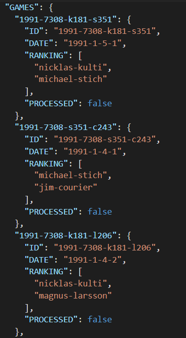

# Reprocesser V1.5

Command line tool  
Processes existing datasets into GamBible compatible database.

## Database

### ELO
#### Games table

#### Players table

### MMR
#### Games table

#### Players table
